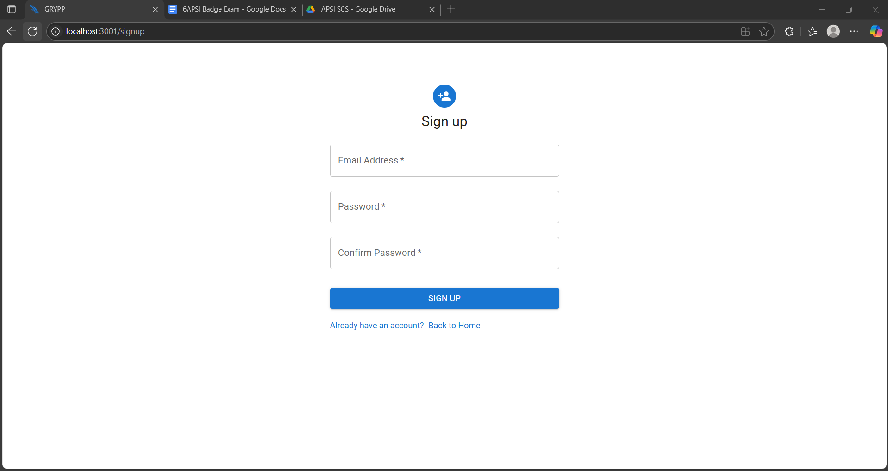

# 6APSI Badge Exam - React Dashboard Application

A modern, responsive dashboard application built with React, Material-UI, and React Router. This application includes authentication, a landing page, and a protected dashboard with user management capabilities.

## Live Demo

[View Live Demo](https://badge-exam.vercel.app/)

## Team Members

- [Gopez, Ralph Louis](https://github.com/sevora)
- [Robles, Eunice](https://github.com/EuniceRobles)
- [Ysais, Carlos Jose](https://github.com/cbysais)
- [Padilla, Kervin Clyde](https://github.com/userkace)
- [Palao, Maria Athaliah December](https://github.com/jupiterhal)

## Screenshots

###### Landing Page


###### Sign Up Page



###### Login Page


###### Dashboard


###### Manage Users


###### Create User


###### User Created Notification


###### Update User


###### User Updated Notification


###### Delete User


###### User Deleted Notification


###### Reporting Page


###### About Page


## Features

- **Authentication**
    - Secure login/logout functionality
    - Protected routes
    - Session persistence
    - Form validation

- **Dashboard**
    - Responsive sidebar navigation
    - User management interface
    - Real-time data display

- **User Management**
    - View user list
    - Add new users
    - Edit existing users
    - Delete users

- **UI/UX**
    - Modern, clean interface
    - Responsive design
    - Smooth page transitions
    - Form validation feedback

## Tech Stack

- **Frontend**
    - React 19
    - React Router v7
    - Material-UI v7
    - Framer Motion (for animations)
    - Axios (for API requests)

- **State Management**
    - React Context API
    - Local Storage (for session persistence)

## Getting Started

### Prerequisites

- Node.js (v16 or later)
- npm or yarn

### Installation

1. Clone the repository:

    ```bash
    git clone https://github.com/userkace/6apsi-badge-exam.git
    cd 6apsi-badge-exam
    ```

2. Install dependencies:

    ```bash
    npm install
    # or
    yarn
    ```

3. Start the development server:

    ```bash
    npm start
    # or
    yarn start
    ```

4. Open [http://localhost:3000](http://localhost:3000) to view it in your browser.

## Authentication

The application uses a secure authentication system:

- Protected routes that redirect unauthenticated users to the login page
- Session persistence using localStorage
- Form validation for login and signup
- Secure token-based authentication

## Project Structure

```
src/
├── auth/               # Authentication components
│   ├── Login.js       # Login page
│   ├── Logout.js      # Logout handler
│   └── Signup.js      # User registration
├── components/        # Reusable UI components
├── context/           # React Context providers
│   ├── AuthContext.js # Authentication state
│   └── UsersContext.js # User data management
├── pages/             # Page components
│   ├── About.js       # About page
│   ├── Dashboard.js   # Main dashboard
│   └── Landing.js     # Landing page
├── App.js            # Main application component
└── index.js          # Application entry point
```

## Available Scripts

- `npm start` - Runs the app in development mode
- `npm test` - Launches the test runner
- `npm run build` - Builds the app for production
- `npm run eject` - Ejects from Create React App (use with caution)

## Acknowledgments

- Material-UI for the awesome UI components
- React Router for routing
- Framer Motion for smooth animations
- Create React App for the project setup
